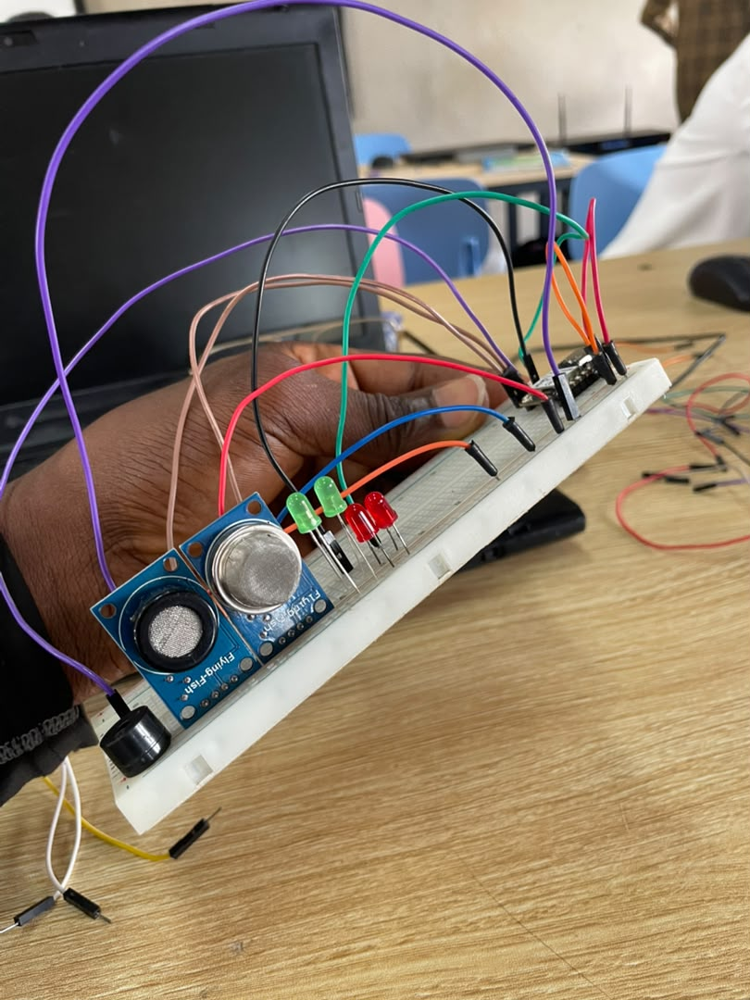
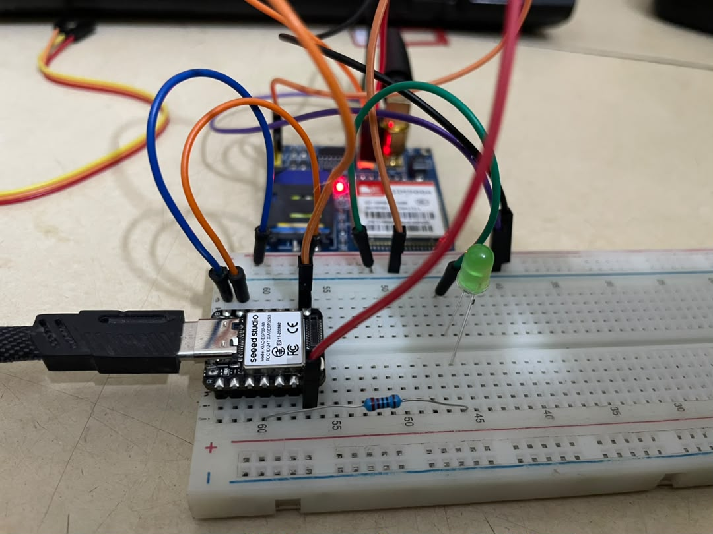

# JOURNAL – jeudi 10-09-2026 (rédigé par Olivier Esso-hana AGNINDOM)

## Activités du jour

La séance d'aujourd'hui a porté sur le routage du PCB, la prise des mesures nécessaires à la modélisation du boîtier, ainsi que sur le test individuel des composants matériels du groupe 17.

- **Travail pratique sur le PCB avec KiCad :** Organisation des composants sur le typon (XIAO ESP32-S3, connecteurs, buzzer et les deux résistances de protection des LED).
- **Relevé des dimensions et modélisation 3D :** Mesure des gabarits des composants en vue de la conception du boîtier sur Fusion 360, avant son impression prochaine sur Bambu Studio.
- **Contrôles matériels individuels :** Vérification, à domicile, du bon fonctionnement de chaque composant du kit.
- **Résolution d'un souci de liaison série :** Changement du câble USB pour parvenir à établir la connexion entre le XIAO ESP32-S3 et MicroPython via Thonny.
- **Essai du module réseau SIM900A :** Tentative d'interfaçage et observation de l'état de la connexion au réseau.

  

## Enseignements tirés

- **Agencement des composants sous KiCad :** Un positionnement réfléchi du microcontrôleur et des connecteurs facilite le routage des pistes et permet de gagner de la place sur la carte.
- **Diagnostic d'un problème de communication USB :** Un câble USB défectueux, ou prévu uniquement pour la charge (sans les lignes de données D+/D-), empêche Thonny IDE de détecter la carte.
- **Lecture du voyant d'état du SIM900A :** Un clignotement rapide et continu de la LED témoin signale que le module cherche le réseau cellulaire sans parvenir à s'y accrocher (souci d'alimentation 2A, d'antenne, ou fermeture/obsolescence du réseau 2G).

## Difficultés rencontrées, puis résolues

- **Connexion impossible entre le XIAO ESP32-S3 et Thonny :** La carte n'était pas reconnue par le logiciel, à cause d'un câble USB inadapté.
  - *Solution :* Remplacement par un câble de données de bonne qualité, permettant d'établir la liaison MicroPython.
- **Échec d'accroche réseau du module SIM900A :** Le clignotement rapide de la LED de statut trahit un défaut d'enregistrement sur le réseau mobile.

## Décisions

- Tester le module SIM900A avec une alimentation externe stabilisée dédiée de $5\text{V}/2\text{A}$, afin de déterminer si le problème d'accroche réseau provient d'un manque de puissance fourni par le port USB.

## Prochaines étapes

- Poursuivre le routage des pistes du PCB sous KiCad et démarrer la modélisation 3D du boîtier sous Fusion 360.