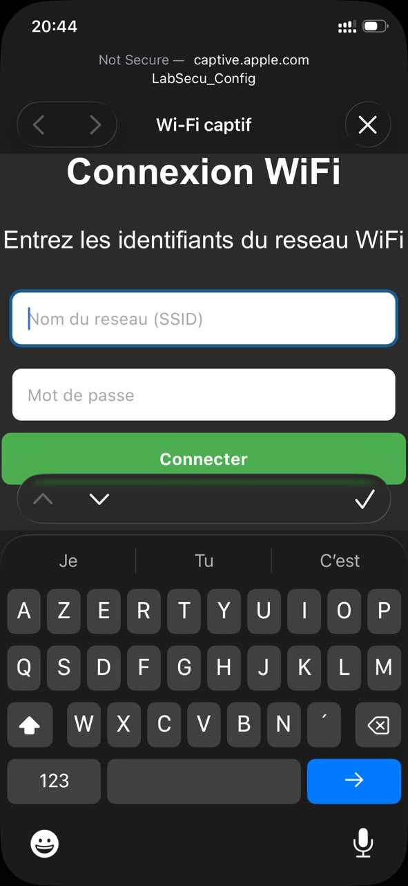

# JOURNAL – samedi 12-09-2026 (rédigé par Esso-hana AGNINDOM)

## Activités du jour

Aujourd'hui, nous avons vérifié le bon fonctionnement individuel de tous nos capteurs et mis en place une solution de communication alternative reposant sur le Wi-Fi et l'envoi d'alertes par Gmail.

- **Validation unitaire du matériel :** Test de chaque capteur pris séparément, à l'aide de son code de contrôle dédié.

  

- **Mise en place d'un portail captif (WiFiManager) :** Création, sur l'ESP32-S3, d'une passerelle de connexion permettant de configurer facilement un nouveau réseau Wi-Fi sans avoir à modifier le code.

  

- **Intégration du protocole d'alerte par e-mail :** Mise en place de l'envoi automatique de notifications via Gmail depuis l'ESP, une fois la connexion Wi-Fi établie.

  
  

- **Avancement du PCB :** Poursuite du travail sur le PCB, dont le circuit a de nouveau dû être modifié ; acquisition de nouvelles connaissances sur le paramétrage et la réalisation du PCB.

## Enseignements tirés

- **Gestion dynamique de la connectivité Wi-Fi :** Mise en place d'un point d'accès temporaire (*Access Point*) sur l'ESP, permettant de renseigner les identifiants Wi-Fi via une interface web locale.
- **Protocole d'envoi d'e-mails (SMTP) :** Recours au Wi-Fi et à des identifiants Gmail sécurisés (mot de passe d'application) pour transmettre des alertes indépendamment du réseau GSM.
- **Validation modulaire :** Intérêt de tester chaque capteur individuellement avant de les regrouper dans un programme global.
- **Paramétrage et réalisation du PCB :** Nouvelles notions acquises sur le paramétrage du PCB et sa réalisation concrète.

## Difficultés rencontrées, puis résolues

- **Blocage de l'ESP32 lors du premier envoi d'e-mail :** Échec d'authentification dû à la sécurité du compte Gmail.
  - *Solution :* Activation de la double authentification et génération d'un mot de passe d'application dédié, pour autoriser la connexion SMTP de l'ESP32.

## Décisions

- Garder la passerelle Wi-Fi et les alertes Gmail comme système principal ou de secours, afin de pallier les difficultés d'accroche réseau des modules GSM.

## Prochaines étapes

- Regrouper la lecture de tous les capteurs validés dans un même programme, afin de déclencher l'envoi automatique d'e-mails en cas d'événement.