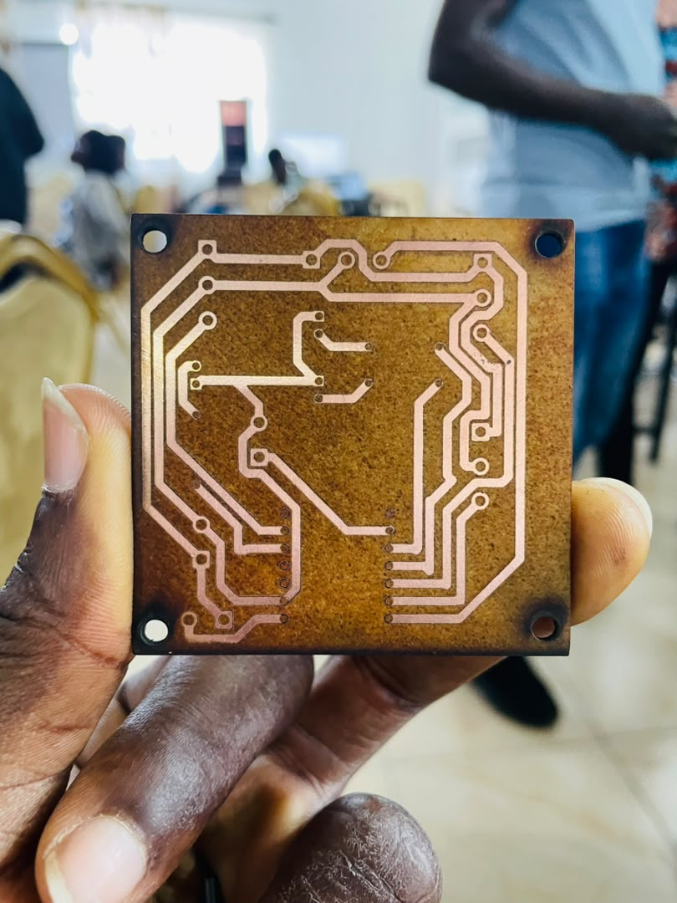
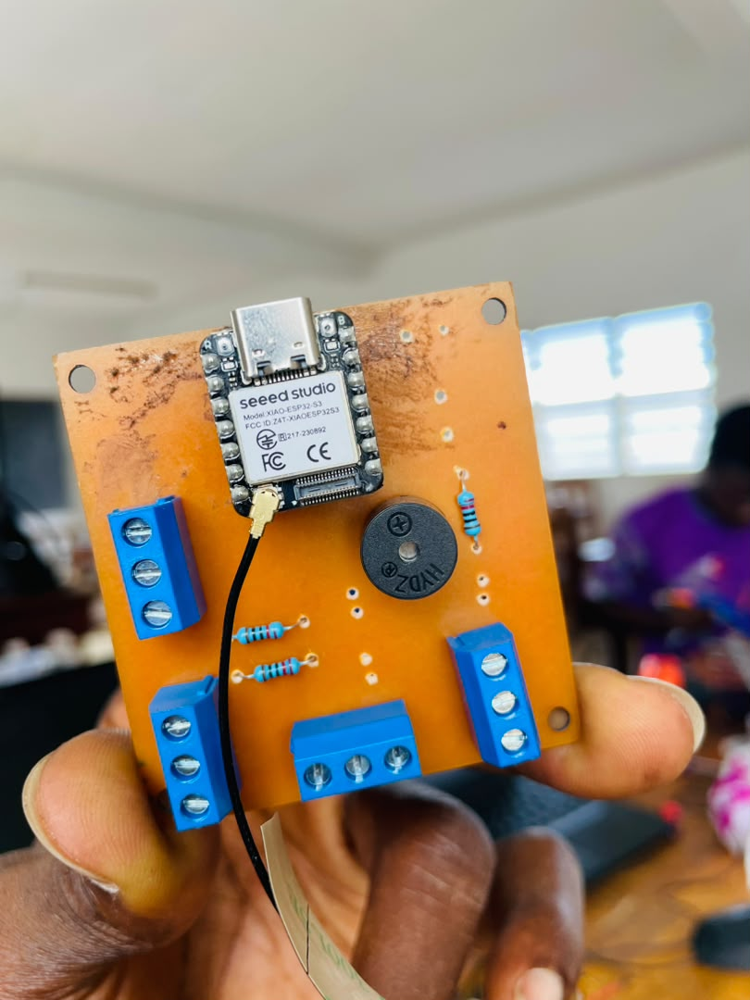

# JOURNAL – mardi 15-09-2026 (rédigé par Olivier Esso-hana AGNINDOM)

## Activités du jour

Aujourd'hui, nous avons continué la fabrication matérielle du prototype en reprenant le PCB et en démarrant l'assemblage physique du système.

- **Nouvelle impression du PCB :** Correction du typon et réimpression en mode miroir, afin de garantir un alignement précis des pistes au moment de la gravure.

  

- **Assemblage électronique :** Soudure minutieuse des composants (connecteurs, supports, résistances,buzzer) sur la carte PCB gravée.

  

- **Modélisation 3D du boîtier :** Conception, sous Fusion 360, de l'enceinte de protection destinée à recevoir le PCB et les capteurs du circuit du projet.

## Enseignements tirés

- **Importance du mode miroir en fabrication de PCB :** Nécessité de vérifier l'orientation du typon avant impression, sous peine d'obtenir un circuit inversé et des empreintes de composants inutilisables.
- **Techniques de soudure sur PCB maison :** Respect du temps de chauffe des pastilles et contrôle visuel de la qualité des joints d'étain, pour éviter ponts de soudure et soudures sèches.
- **Conception de boîtier mécanique :** Prise en compte des tolérances d'assemblage ainsi que des ouvertures nécessaires au passage des câbles et au positionnement des capteurs.

## Difficultés rencontrées, puis résolues

- **Risque d'inversion des broches lors de la première impression du PCB :** Le tracé initial, non inversé, aurait entraîné un sens de connexion incorrect des composants.
  - *Solution :* Relance de l'impression du masque en mode miroir dans xtool, avant le transfert sur la plaque.

## Décisions

- Finaliser les réglages du boîtier sous Fusion 360, puis lancer son impression 3D sous Bambu Studio pour valider l'intégration mécanique.

## Prochaines étapes

- Achever la soudure des derniers éléments, imprimer le boîtier, et effectuer le premier test d'intégration matérielle complet.