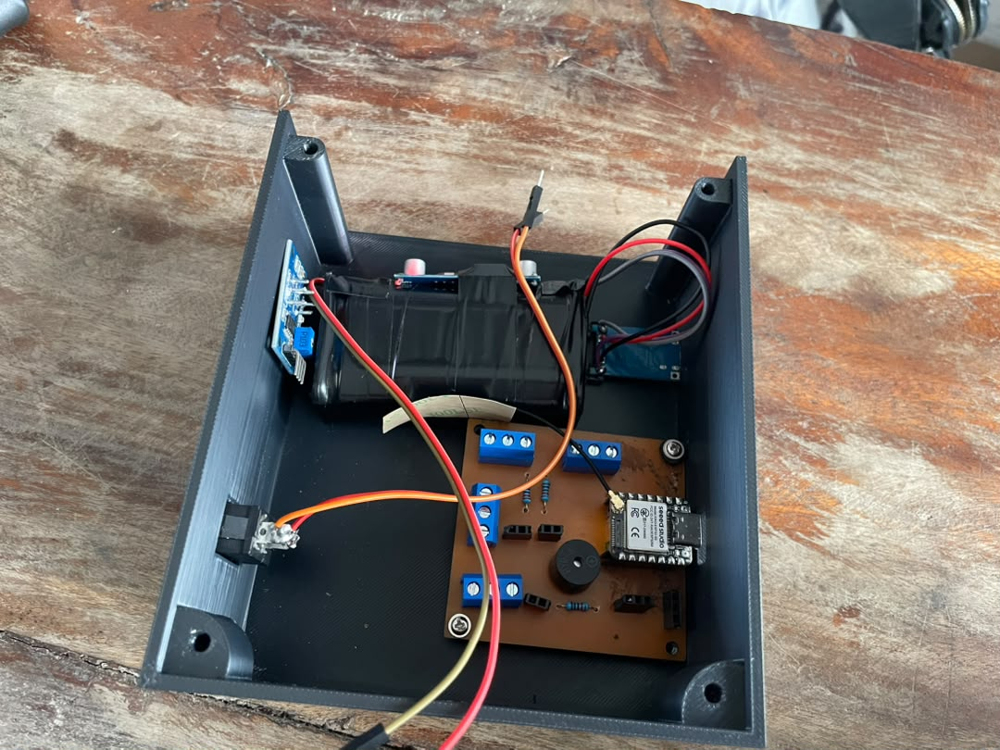

# JOURNAL – mercredi 16-09-2026 (rédigé par Olivier Esso-hana AGNINDOM)

## Activités du jour

La journée a été consacrée à l'intégration mécanique du prototype, avec l'installation physique des composants électroniques à l'intérieur du boîtier fraîchement imprimé en 3D.

- **Impression 3D :** Fabrication de l'enceinte de protection à l'aide de l'imprimante Bambu Lab H2S.
- **Intégration du matériel :** Mise en place de la carte PCB, du microcontrôleur et de l'ensemble des capteurs au sein du boîtier.

  

- **Réglages mécaniques :** Réorganisation du positionnement interne des composants et des câbles, afin d'obtenir un ajustement parfait à l'intérieur du boîtier.

## Enseignements tirés

- **Contraintes liées aux tolérances d'impression 3D :** Nécessité de tenir compte du retrait de matière et de l'espace de jeu requis pour permettre une insertion correcte des cartes et des capteurs.
- **Organisation de l'espace interne :** Optimisation du cheminement des câbles afin d'éviter tout écrasement des connecteurs ou faux contact une fois le boîtier refermé.

## Difficultés rencontrées, puis résolues

- **Encombrement excessif des composants dans le boîtier :** La disposition initiale rendait la fermeture du boîtier difficile et gênait certains connecteurs de capteurs.
  - *Solution :* Repositionnement des éléments internes et réorganisation de l'agencement pour dégager de l'espace supplémentaire.

## Décisions

- S'assurer de la bonne fermeture et de l'ergonomie du boîtier avant de passer au test fonctionnel global de l'ensemble assemblé.

## Prochaines étapes

- Mener les essais de fonctionnement complet du système, une fois intégré dans son boîtier définitif.