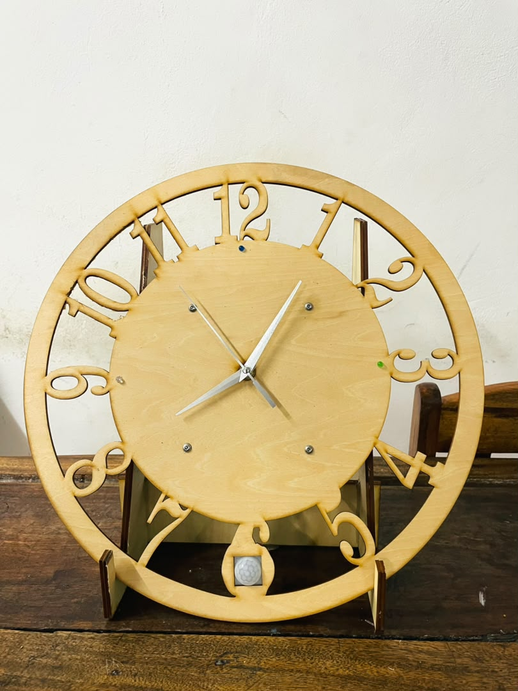
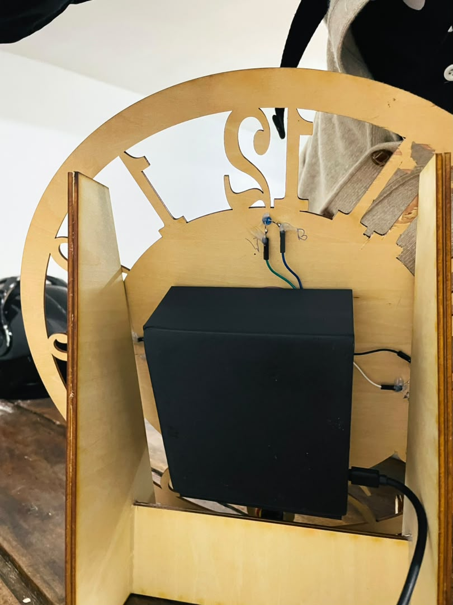
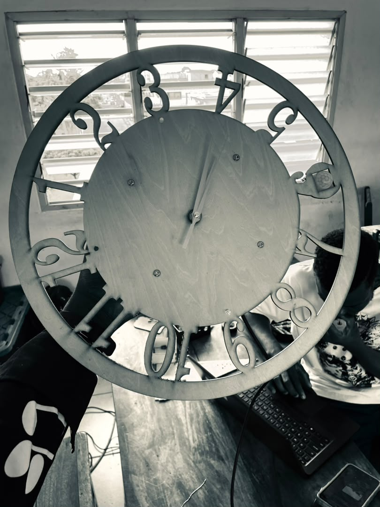
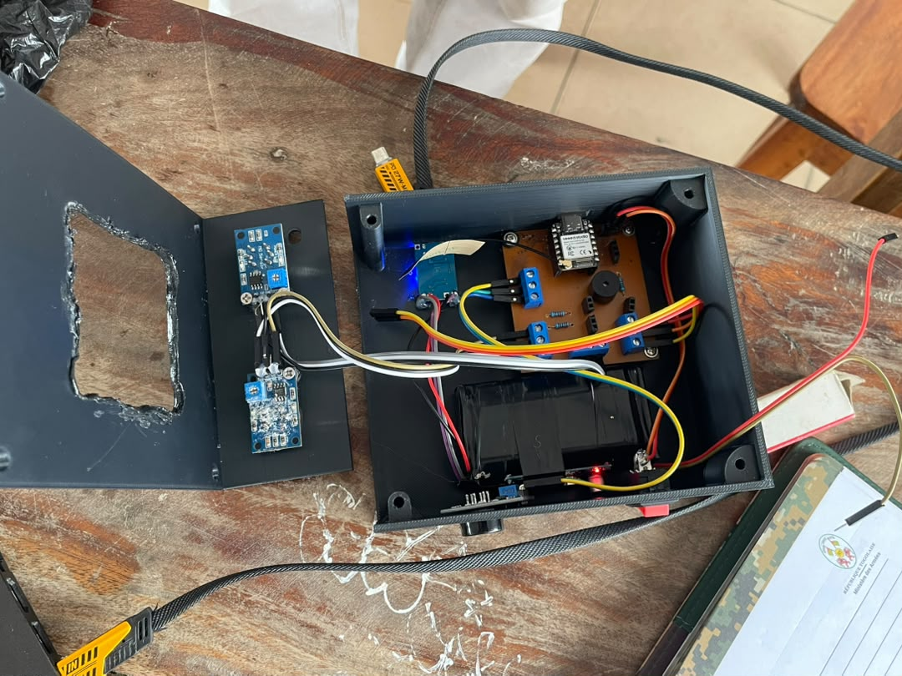

# JOURNAL - du jeudi 17-09-2026 (rédigé par Olivier Esso-hana AGNINDOM)

## Fait aujourd'hui

Aujourd'hui, nous avons finalisé l'assemblage du boîtier, procédé à une série de contrôles électriques et fonctionnels, terminé le montage de l'horloge et clôturé la mise au point globale du projet.

- **Finalisation de l'assemblage du boîtier :** Achèvement du montage physique du dispositif.

  
 
- **Contrôle de continuité :** Test de la continuité électrique de chaque capteur et de chaque composant du circuit.
- **Tests fonctionnels :** Vérification et évaluation du bon fonctionnement global du dispositif.
- **Montage de l'horloge :** Finalisation de l'installation de l'horloge et impression des pièces de fixation destinées à sa mise en place sur le boîtier.

  

- **Finalisation du projet :** Mise au point complète du système de détection d'intrusion, de gaz polluant et de fumée du FabLab, incluant le déclenchement de l'alarme, l'envoi automatique d'un e-mail à l'administrateur et la visualisation en temps réel sur l'application.
- **Préparation de la présentation :** Élaboration des diapositives (slides) pour la présentation du projet prévue demain.

## Appris

- **Montage d'une horloge, de A à Z :** Maîtrise du processus complet de montage d'une horloge, depuis les premières étapes jusqu'à la finition.
- **Conception des pièces de fixation de l'horloge :** Réalisation des supports nécessaires à la pose de l'horloge sur le boîtier.

## Raté, puis corrigé

- **Déconnexion du câble du capteur PIR après le montage final :** Le câble de connexion du détecteur de mouvement (PIR) s'est retrouvé débranché une fois l'assemblage terminé.
  - *Correction :* Démontage partiel, vérification du branchement, puis correction de la connexion.
- **Mauvais positionnement de l'horloge sur la face supérieure du boîtier :** La première tentative de fixation par collage n'a pas donné un résultat satisfaisant.
  - *Correction :* Adoption d'une nouvelle technique de fixation par boulonnage.

  

## Décider

- Adopter le boulonnage comme méthode définitive de fixation de l'horloge sur le boîtier, plus fiable que le collage.

## À faire demain

- Présenter le projet devant le jury, puis devant les médias, en s'appuyant sur les slides préparées aujourd'hui.